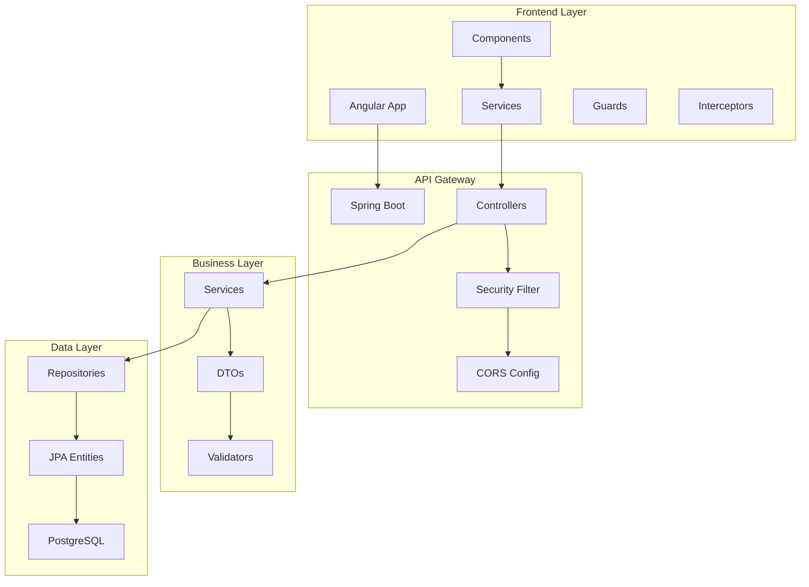
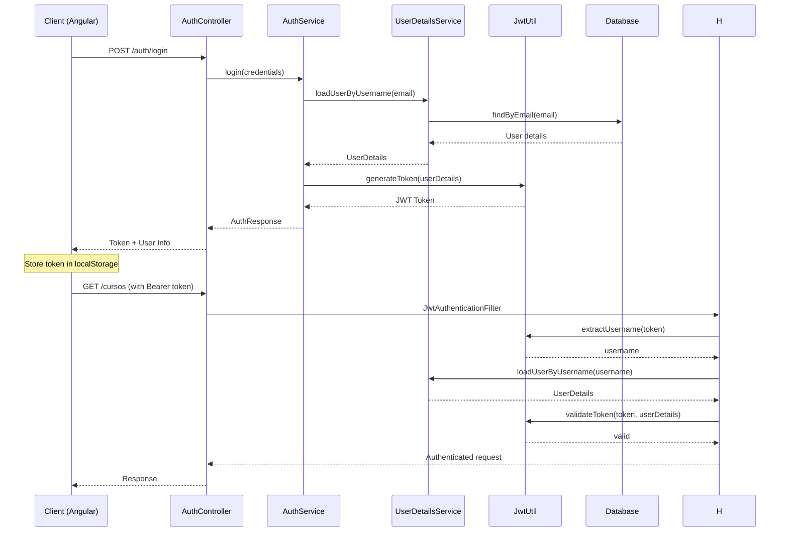
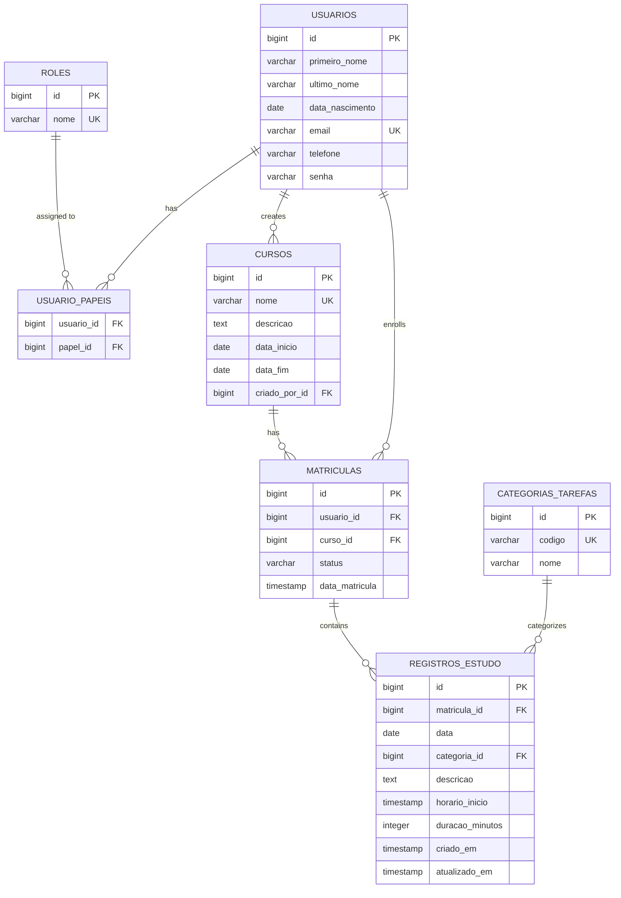
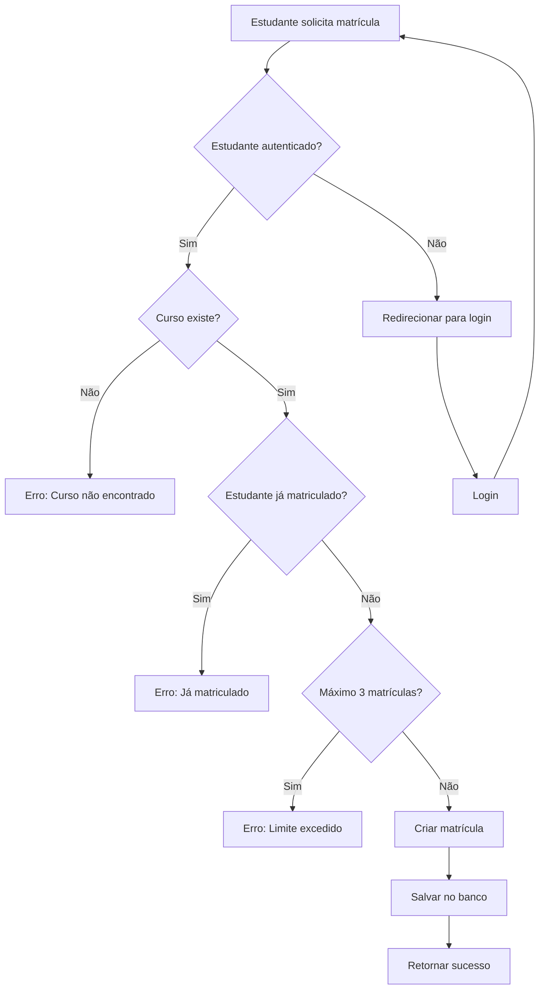
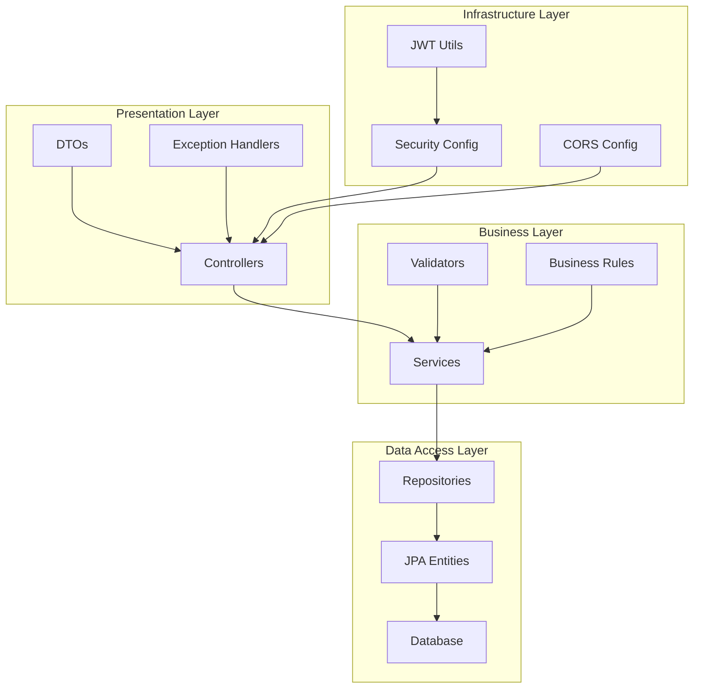
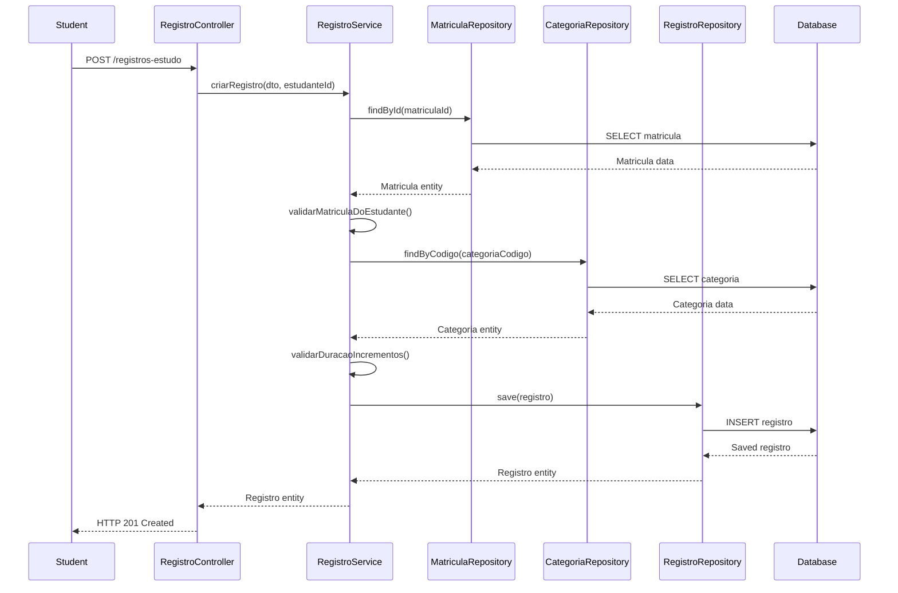
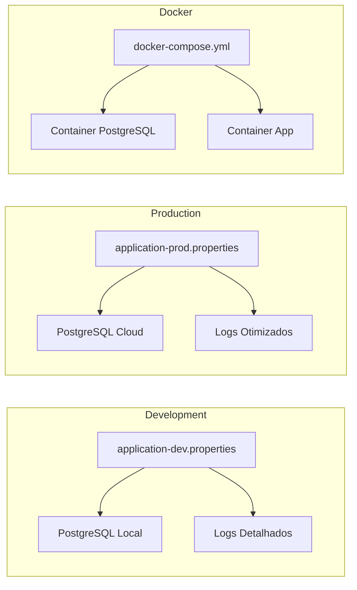
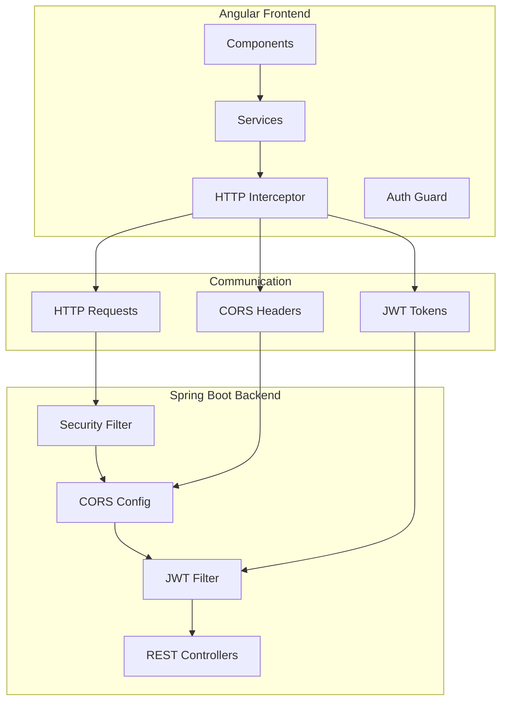
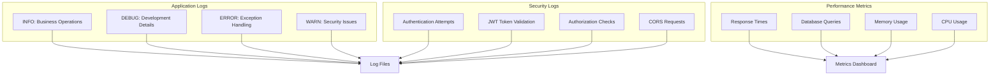

# 🏗️ Diagramas de Arquitetura - LMS

## 1. Arquitetura Geral do Sistema

## 2. Fluxo de Autenticação JWT

## 3. Arquitetura de Banco de Dados

## 4. Fluxo de Negócio - Matrícula em Curso

## 5. Arquitetura de Segurança

```mermaid
graph TB
    subgraph "Security Layers"
        A[CORS Filter]
        B[JWT Authentication Filter]
        C[Authorization Filter]
        D[Method Security]
    end
    
    subgraph "Authentication Flow"
        E[Login Request]
        F[Validate Credentials]
        G[Generate JWT]
        H[Return Token]
    end
    
    subgraph "Authorization Flow"
        I[Protected Request]
        J[Extract Token]
        K[Validate Token]
        L[Check Roles]
        M[Allow/Deny]
    end
    
    A --> B
    B --> C
    C --> D
    
    E --> F
    F --> G
    G --> H
    
    I --> J
    J --> K
    K --> L
    L --> M
```

## 6. Estrutura de Camadas do Backend

## 7. Fluxo de Registro de Estudo

## 8. Configuração de Ambiente

## 9. Integração Frontend-Backend

## 10. Monitoramento e Logs

